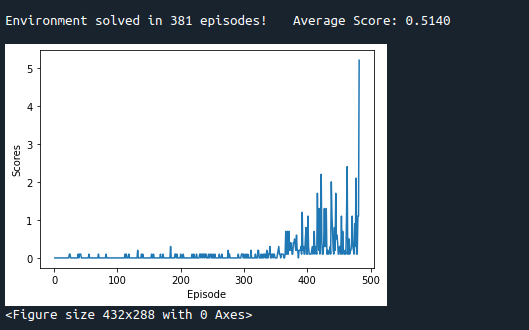
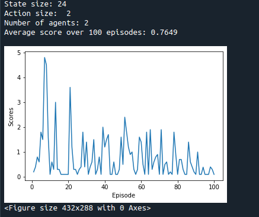

# Reinforcement Learning: Continuous Control
## Code
There are four python files in the project repo:
* `model.py`: contains the code specifying the backbone neural network structure.

* `maddpg.py`: contains the core code of multi-agent DDPG algorithm

* `train.py`: contains the code for training the agent. To launch the code, use 

            python train.py

* `test.py`: contains the code to test the trained agent.

            python test.py

## Data
There are four `.pth` files in the repo:
* `actor_agent_1.pth`: the trained Actor network of the 1st agent
* `actor_agent_2.pth`: the trained Actor network of the 2nd agent
* `critic_agent_1.pth`: the trained Critic network of the 1st agent
* `critic_agent_2.path`: the trained Critic network of the 2nd agent

## Learning Algorithm
### Agents
There are two agents, both trained with DDPG algorithm.

### Network Structure
In each agent, there are two feedforward neural networks, one for the Actor, one for the Critic.
* **Actor network**: Given an input state, the Actor network outputs the correponding 2-dimensioal action vector.
    * **Input layer**: The input to the neural network is the current state in the continuous control environment, which is a 24 dimensional vector.
    * **Hidden layers**: There are two hidden layers. Both have 256 neurons.
    * **Output layer**:   The output is the action parameter, which is a two dimentional vector.
    * **Batch normalization**: Batch normalization us applied to the two hidden layers.

* **Critic network**:  Given an input state and a action vector, the Critic network estimates the value of applying the input action to the input state.
    * **Input layer**: The input to the neural network is the current state in the continuous control environment, which is a 24 dimensional vector.
    * **Hidden layers**: There are two hidden layers. Both have 256 neurons. The input to the 2nd hidden layer is the output of the 1st hidden layer concatednated with the input action vector, namely a 256 + 42= 260 dimentional vector.
    * **Output layer**:   The output is a number, indicating the value (score) of applying the input action to the input state.
    * **Batch normalization**: Batch normalization us applied to the two hidden layers.

### Training Algorithm
There are severl components in the training algorithm.

1. **Replay Buffer**. This is a `deque` buffer recording the playing experiences. Each record is a **experience tuple** `(S, A, R, S', done)` consisting of `state`, `action`, `reward`, `next_state` and `done` of the environment. The agent plays according to current agent's parameters. After every certain steps, a batch of experience tuples are randomly sampled from the replay buffer, which are then used to update the agent parameters. 

2. **TD Learning for Critic**. The TD learning algorithm is used to update the Critic network. Namely, we hope for each experience tuple `(S, A, R, S', done)`, the Q score `Q(S, A)` can be closed to the following TD-target
    
        TD-target = R + GAMMA * Q(S', Actor(S')) * (1-done) 
    where `GAMMA` is the discount parameter. And `Actor(S')` is the output of Actor netrowk, which estimates the action corresponding to the `S'` state. Comparing with Q-learning, here we use `Actor(S')` to get the next action, instead of using the Critic network itself.

3. **Maximizing the value of the Actor output**. The Actor network directly estimates the action vector given an input space, whose value can be estimated by the Critic network. Therefore we train the Actor network such that the value of its output is as big as possible. Namely, the Actor network should give high value actions.

4. **Training two agents**. In each learning step, DDPG algorithm is applied to train each of the two agents.

## Hyperparameters
A few hyperparameters are used in the training process. They are listed as follows:

* `BUFF_SIZE = 100000`, the size of the replay buffer.
* `BATCH_SIZE = 128`, the batch size in stochastic gradien descent.
* `LR_ACTOR = 1e-2`,        learning rate of the actor.
* `LR_CRITIC = 1e-4`,       learning rate of the critic.
* `GAMMA = 0.99`, the discount factor for computing accumulated gains.
* `TAU = 1e-3`, this is used in `soft_update` to update the target parameters.
* `UPDATE_EVERY = 1`,      model is updated every UPDATE_EVERY time steps.
* `N_UPDATES = 3`,         number of updates in every `UPDATE_EVERY` time steps.
* `sigma`, controls the noise added to the action for exploration:
    * `sigma_start = 0.2`, the initial value of sigma.
    * `sigma_end = 0.01`, the minial value of sigma.
    * `sigma_decay = 0.995`, the decaying factor of sigma after each episode.

## Note
The code and algorithm used in this project is pretty much the same as what I did in the [continuous constrol](https://github.com/mwusdv/rl_p2_continuous-control-v1) project. The main differences are:

* Two agents are trained simutanenously.
* Batch normalization are used and found very helpful.

## Results
### Training
To launch the training code, please run 

    python train.py

Here is plot of the reward in each episode

As can be seen from the recores, the environment can be solved at before the 381-th episode.

### Test
To play with trained agent, please run:

    python test.py

It can be seen that with the trained agent played the game for 100 episdes, an average score of 0.7649 has been obtained during the test run.

## Future Works
Learn and try more algorithms and projects about multi-agent learning.

